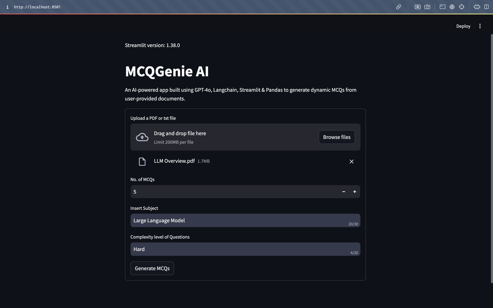

# MCQGenie AI



<div align="center">
    
    
    
    
</div>

## 📋 <a name="table">Table of Contents</a>

1. [Introduction](#introduction)
2. [Features](#features)
3. [Tech Stack](#tech-stack)
4. [Getting Started](#quick-start)

## <a name="introduction">Introduction</a>

This repository contains the code of an AI app, which is able to generate MCQs quiz, based on the data, difficulty & subject provided by the user. The AI Model is fine-trained & is made on top of GPT-4o & LangChain. The UI is made using Streamlit. This AI application is helpful for eduactional purposes, resulting in increase of knowledge, in particular domain.

## <a name="features">Features</a>

👉 **MCQ Generation from Documents**: Users can upload PDF or text files, and the app generates multiple-choice questions (MCQs) based on the content using GPT-4.

👉 **Customizable Question Count**: Users can specify the number of MCQs they want to generate from the document.

👉 **Subject and Tone Selection**: Users can provide the subject and specify the complexity level of the questions for tailored quiz generation.

👉 **Automatic Quiz Table**: Generated MCQs are automatically displayed in a table format using Pandas, allowing users to easily review and analyze them.

👉 **Detailed Review Section**: The app generates a review of the MCQs, assessing the complexity and providing feedback.

👉 **PDF and Text File Support**: Users can upload both PDF and text files as input for quiz generation.

👉 **Streamlined Interface**: Built with Streamlit, the app provides a user-friendly interface for easy navigation and interaction.


## <a name="tech-stack">Tech Stack 🛠️</a>

- [Python](https://www.python.org/) - Programming Language
- [LangChain](https://www.langchain.com/) - LLM Framework
- [GPT-4o](https://openai.com/index/hello-gpt-4o/) - OpenAI Model
- [Streamlit](https://streamlit.io/) - Python Framework

## <a name="#quick-start">Getting Started</a>

To get started with this project, follow these steps:

1. Clone the repository:

```bash
git clone https://github.com/Chandramani05/MCQGenie-AI.git
```

2. Open the project in your preferred code editor.

3. Create a virtual environment of suitable python version using:

```bash
conda create -n venv python=3.12
```

4. Activate environment using:

```bash
`source activate venv` or `conda activate venv`
```

5. Install the project dependencies using pip:

```bash
pip install -r requirements.txt
```

6. Set Up Environment Variables by creating a new file named `.env` in the root of your project and add the following variables:

```env
OPENAI_API_KEY="your credentials"

```

7. Run the project

```bash
`streamlit run StreamlitApp.py` or `python -m streamlit run StreamlitApp.py`
```

8. Open [http://localhost:8501](http://localhost:8501) to view it in your browser.


---

<!----->
